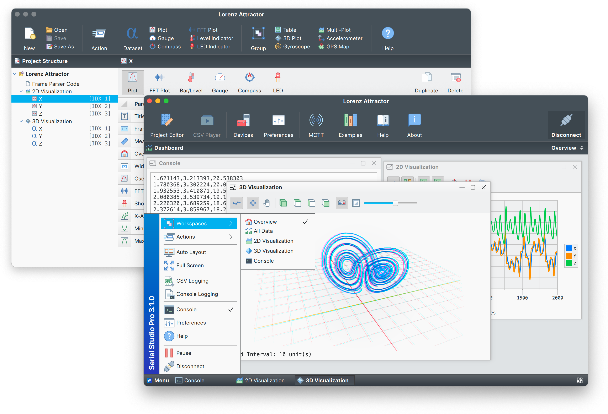

# readme again

这是我fork 的 Serial Studio，在此基础上自行学习开发。

#  Serial Studio

[](https://github.com/Serial-Studio/Serial-Studio/releases/)
[](https://deepwiki.com/Serial-Studio/Serial-Studio)
[](https://instagram.com/serialstudio.app)
[](https://www.paypal.com/donate?hosted_button_id=XN68J47QJKYDE)
[](https://app.codacy.com/gh/Serial-Studio/Serial-Studio/dashboard?utm_source=gh&utm_medium=referral&utm_content=&utm_campaign=Badge_grade)

**Serial Studio** is an open-core, cross-platform telemetry dashboard and real-time data visualization tool. It supports input from serial ports, Bluetooth Low Energy (BLE), MQTT, TCP/UDP sockets and Audio devices, allowing data acquisition from embedded devices, analog circuits, external software, and networked services.

Serial Studio runs on Windows, macOS, and Linux. It is suited for telemetry monitoring, sensor data analysis, and real-time debugging in educational, hobbyist, and professional environments.



## Download
Serial Studio is available as source code and official precompiled binaries for Windows, macOS, and Linux.

- [Latest Stable Release](https://github.com/Serial-Studio/Serial-Studio/releases/latest)
- [Pre-release Builds](https://github.com/Serial-Studio/Serial-Studio/releases/continuous)

#### Microsoft Windows:
Requires the [Microsoft Visual C++ Redistributable (x64)](https://learn.microsoft.com/en-us/cpp/windows/latest-supported-vc-redist?view=msvc-170#latest-microsoft-visual-c-redistributable-version). On first launch, Windows may show a warning about an unknown developer, click _"More Info → Run Anyway"_ to continue.

#### macOS: 
Distributed as a universal DMG. Open the DMG file and drag **Serial Studio** into the **Applications** folder.
Alternatively, you can try installing via Homebrew:

```bash
brew install --cask serial-studio
```

**Note:** The Homebrew cask is community-maintained. It’s available, but not officially developed or tested by me.

#### Linux:
The recommended way to install Serial Studio on Linux is via the official pre-built [AppImage](https://appimage.org/). Make it executable and run it:

```bash
chmod +x SerialStudio-Pro-3.1.10-Linux-x64.AppImage
./SerialStudio-Pro-3.1.10-Linux-x64.AppImage
```

If the AppImage fails to launch, your system may be missing `libfuse2`:

```bash
sudo apt install libfuse2
```

**Tip:** For better desktop integration (menu entries, updates, icons), use [AppImageLauncher](https://github.com/TheAssassin/AppImageLauncher).

##### Flatpak (via Flathub)
Serial Studio is also available on [Flathub](https://flathub.org/apps/com.serial_studio.Serial-Studio). This version receives regular updates and may offer better support for ARM64 systems. However, minor graphical glitches may occur on some desktop environments—especially under Wayland (e.g., missing window shadows).

##### Raspberry Pi / ARM64:
An ARM64 AppImage is available for Raspberry Pi and similar devices. Performance varies based on hardware and GPU drivers, since the UI depends on GPU acceleration. The ARM64 AppImage requires:
- A 64-bit Linux OS equivalent to or newer than **Ubuntu 24.04** (due to a `glibc 2.38` dependency)
- `libfuse2` installed

Make sure your system meets these requirements before running the AppImage.

## Features

#### Operation Modes:
- **Project File Mode (recommended):** Uses local JSON files created with the **Project Editor** to define the dashboard layout and data mapping.
- **Quick Plot Mode:** Automatically plots comma-separated values with no configuration.
- **Device-defined Mode:** Dashboards are fully defined by incoming JSON data from the device.

#### Core Capabilities:
- **Cross-platform:** Runs on Windows, macOS, and Linux.
- **CSV export:** Save received data for offline analysis or processing.
- **Multiple data sources:** Supports serial ports, MQTT, Bluetooth LE, audio devices and network sockets (TCP/UDP).
- **Customizable visualization:** Build dashboards using various widgets via the integrated project editor.
- **Advanced frame decoding:** Use a custom JavaScript function to preprocess raw data or handle complex binary formats.
- **MQTT support:** Publish and receive data over the internet for remote visualization.

## Documentation

Refer to the [Wiki](https://github.com/Serial-Studio/Serial-Studio/wiki) for complete guides and examples:

- **Installation:** Instructions for Windows, macOS, and Linux.
- **Quick Start:** Connect a device and visualize data in minutes.
- **Advanced Usage:** Learn about data flow, frame parsing, and dashboard customization.
- **Examples:** Sample code and projects to accelerate learning.

## Building Serial Studio

The only required dependency to build Serial Studio from source is [Qt](https://www.qt.io/download-open-source/), preferably with all modules and plugins installed. The project is built using **Qt 6.9.2**.

#### Additional Requirements for Linux

If you’re compiling on Linux, install the following packages:

```bash
sudo apt install libgl1-mesa-dev build-essential
```

#### Build Instructions

Once Qt is installed, you can compile the project by opening `CMakeLists.txt` in your preferred IDE or using the terminal:

```bash
mkdir build
cd build
cmake ../ -DPRODUCTION_OPTIMIZATION=ON -DCMAKE_BUILD_TYPE=Release
cmake --build . -j$(nproc)
```

The build system produces a fully GPLv3-compliant version of Serial Studio with all available features.

## Support the Project
Serial Studio is developed and maintained by [Alex Spataru](https://github.com/alex-spataru).  
It is open source and community-driven, with commercial options available for users who need advanced features or business-friendly licensing.

If Serial Studio is useful to you, consider supporting its development:

- [**Donate via PayPal**](https://www.paypal.com/donate?hosted_button_id=XN68J47QJKYDE): Helps keep the project active and sustainable.

Commercial licenses directly fund continued development, bug fixes, and new features.

## Licensing

Serial Studio uses a **dual-license model** that distinguishes between open-source usage and commercial distribution:

- [LICENSE.md](LICENSE.md): summary of dual-license structure and usage terms
- [LICENSES/GPL-3.0-only.txt](LICENSES/GPL-3.0-only.txt): full GNU GPLv3 text for open-source source code
- [LICENSES/LicenseRef-SerialStudio-Commercial.txt](LICENSES/LicenseRef-SerialStudio-Commercial.txt): full terms for proprietary features and official binaries

Source files are individually marked with SPDX headers indicating whether they are:
- Licensed under `GPL-3.0-only`
- Licensed under `LicenseRef-SerialStudio-Commercial`
- Or dual-licensed as `GPL-3.0-only OR LicenseRef-SerialStudio-Commercial`

This structure allows developers to build and distribute GPL-compliant versions while protecting commercial functionality.

## GPL Version Features

This is the open-source GPLv3 version of Serial Studio. It includes:

- ✅ All core visualization and telemetry features
- ✅ Support for Serial, BLE, MQTT, TCP/UDP, and Audio inputs
- ✅ Real-time data plotting and dashboard widgets
- ✅ CSV export and project file management
- ✅ Full GPL compliance for commercial and non-commercial use
- ⚠️ Must comply with GPL and Qt licensing terms
